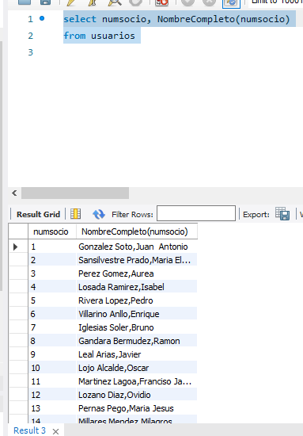

# EJERCICIOS U.D. 6 MySQL

## Procedimientos

1. Crear un procedimiento para añadir un usuario calculando la clave correspondiente y comprobando que el tipo de usuario es válido.  
   - Parámetros: DNI, Nombre, Apellidos, Fecha de Nacimiento y Tipo  
   - Fecha de Alta: actual  
   - Cuota: 0  
   - Debe devolver el nº de usuario o -1 si no se insertó  

```sql
delimiter $$

delimiter $$

drop procedure if exists ejercicio1 $$
create procedure ejercicio1 (midni varchar(9), minombre varchar(20), miapellidos varchar(20), mifechanacimiento datetime,
mitipousuario varchar(2), out salida int)
begin
declare tipo varchar(2);
declare miclave int;

-- comprobar si el tipo de usuario existe

select tipousuario
into tipo
from tiposusuarios
where tipousuario = mitipousuario;

	if tipo is null then
		set salida = -1; -- no existe --> fin
	else -- si existe --> buscar el utlimo usuario e insertar
		select ifnull(max(numsocio),0)
		into miclave
		from usuarios;
		set miclave = miclave+1;

		insert into usuarios values(miclave,midni,minombre,miapellidos,mifechanacimiento,
		mitipousuario,curdate(),0,default);
		set salida = miclave;
	end if;
end
```

2. Crear un procedimiento que devuelva el número de ejemplares disponibles y en préstamo de un libro (búsqueda por código o por título).

```sql
delimiter $$

drop procedure if exists ejercicio2 $$
create procedure ejercicio2(
		micodigo varchar(75),
        out disponibles int,
        out prestables int
)
begin
	
		select count(prestable)
        into disponible
        from ejemplares
        where prestable = 0 and CodLocalizacion = micodigo;
        
        select count(prestable)
        into prestado
        from ejemplares
        where prestable = -1 and CodLocalizacion = micodigo;

end
/*
select count(prestable)
        into disponible
        from ejemplares e join libros l
        on e.codlocalizacion = l.codlocalizacion
        where prestable = 0 and titulo like concat("%",mititulo,"%");

select count(prestable)
        into disponible
        from ejemplares e join libros l
        on e.codlocalizacion = l.codlocalizacion
        where prestable = -1 and titulo like concat("%",mititulo,"%");
*/
/*
delimiter $$

drop procedure if exists ejercicio2 $$

create procedure ejercicio2( mitituloOcodigo varchar(75), out disponible int, out prestamo int)
begin
-- Declaramos una variable para guardar el código real del libro
DECLARE v_codigo VARCHAR(6);

-- PASO 1: Comprobamos lo que nos mete el usuario (título o código)
-- y guardamos su código en nuestra variable
SELECT codlocalizacion INTO v_codigo
FROM libros
WHERE titulo like concat("%",mitituloOcodigo,"%") OR codlocalizacion = mitituloOcodigo
LIMIT 1; -- Limit 1 asegura que no dé error si hay más de un resultado

-- PASO 2: Contamos cuántos están disponibles usando ese código
-- (Asumo que tienes una columna 'estado' o similar en la tabla ejemplares)
SELECT COUNT(*)
INTO disponible
FROM ejemplares
WHERE codlocalizacion = v_codigo AND prestable = 0;


-- PASO 3: Contamos cuántos están prestados usando ese código
SELECT COUNT(*)
INTO prestamo
FROM ejemplares
WHERE codlocalizacion = v_codigo AND prestable = -1;

end
*/
```

3. Procedimiento que cree una tabla nueva **ProfeDepto** con:
   - Profesores (Código, Nombre, Apellidos)
   - Departamentos (Número y Nombre)
   - Asignar clave primaria  
```sql
delimiter $$
drop procedure if exists ejercicio3 $$
create procedure ejercicio3()
begin
	drop table if exists profedepto;
    create table ProfeDepto (primary key(numsocio)) as
    select u.numsocio, u.nombreusuario, u.apellidosusuario,
		d.numdpto, d.nombredpto
    from usuarios u join profesores o join areas a join departamentos d
    on u.NumSocio=p.NumSocio and p.CodArea=a.CodArea and a.numdpto=d.numdpto
    where u.TipoUsuario = 'P'
    ;
	
end
```
```sql
4. Crear un procedimiento que devuelva:
   - Edad de un usuario  
   - Antigüedad como socio  
   - Cuota mensual total  

delimiter $$
drop procedure if exists ejercicio4 $$
create procedure ejercicio4(
minumsocio int,
out edad int, 
out antig int,
out cuotaTotal decimal(20,4))

begin
	select  year(curdate())-year(fechanacimiento),
			year(curdate())-year(fechaalta),
            cuotamensual + ifnull(cuotaextra,0)
    into edad, antig, cuotatotal
    from usuario
    where numsocio=minumsocio
    ;
end
```
5. Crear un procedimiento para consultas con múltiples criterios sobre la tabla **Usuarios**:
   - DNI (=)  
   - Apellidos (LIKE)  
   - CuotaTotal (>=)  

6. Crear un procedimiento (**ver_tablas**) que muestre los nombres de las tablas de una base de datos pasada como parámetro.  
   - Informar si:
     - No existe la base de datos  
     - Existe pero no tiene tablas  

---

## Cursores

1. Usando un cursor, actualizar las cuotas extras de los profesores incrementándolas en un porcentaje dado.

2. Realizar un listado de usuarios organizado por tipos de usuario:

| Tipo de Usuario | Usuarios |
|-----------------|----------|
|                 |          |
|                 |          |
|                 |          |

---

## Funciones

1. Crear una función que devuelva:
   - Nombre y apellidos (apellidos, nombre)  
   - A partir de la clave de usuario  

```sql
CREATE DEFINER=`root`@`localhost` FUNCTION `NombreCompleto`(id int) RETURNS varchar(100)
    DETERMINISTIC
BEGIN
	declare resultado varchar(100);
	select concat(apellidosusuario, ',', nombreusuario)
    into resultado
    from usuarios
    where numsocio=id;
RETURN resultado;
END
```

Comprobación:

```sql
select numsocio, NombreCompleto(numsocio)
from usuarios
```


2. Crear una función que devuelva:
   - Número de años completos entre una fecha dada y la actual  

```sql
CREATE DEFINER=`root`@`localhost` FUNCTION `Edad`(miFecha date) RETURNS int
    DETERMINISTIC
BEGIN
	RETURN truncate(datediff(curdate(), miFecha)/365.25,0);
END
```

Comprobación:

```sql
select numsocio,NombreCompleto(numsocio) as NC, edad(fechanacimiento) as Edad, edad(fechaalta) as Antigüedad
from usuarios
```


3. Crear una función que indique:
   - Departamento de un profesor  
   - Devuelve:
     - Nombre del departamento  
     - O "No es profesor"  

```sql
CREATE FUNCTION `Departamento` (miclave int)
RETURNS varchar(50)
deterministic
BEGIN
	declare resultado varchar(50);
    
	select d.nombredpto
    into resultado
    from departamentos d join areas a join profesores p join usuarios u
    on d.numdpto=a.numdpto and a.codarea = p.codarea and p.numsocio = u.numsocio
    where u.tipousuario = 'P' and u.numsocio=miclave;
    
    if resultado is null then
		set resultado="No es profesor";
	end if;
    
    return resultado;
END
```

Comprobación:

```sql
select numsocio,NombreCompleto(numsocio), tipousuario, Departamento(numsocio)
from usuarios
order by numsocio;
```


---

## Triggers

1. Crear triggers para:
   - Poner en mayúsculas nombre y apellidos al insertar o modificar  

2. Crear triggers para:
   - Mantener una copia actualizada de la tabla usuarios  

3. Crear triggers para:
   - Controlar y registrar cambios en la tabla departamentos  

4. Crear un trigger que:
   - Impida insertar libros con:
     - Menos de 20 páginas  
     - Más de 1000 páginas  
