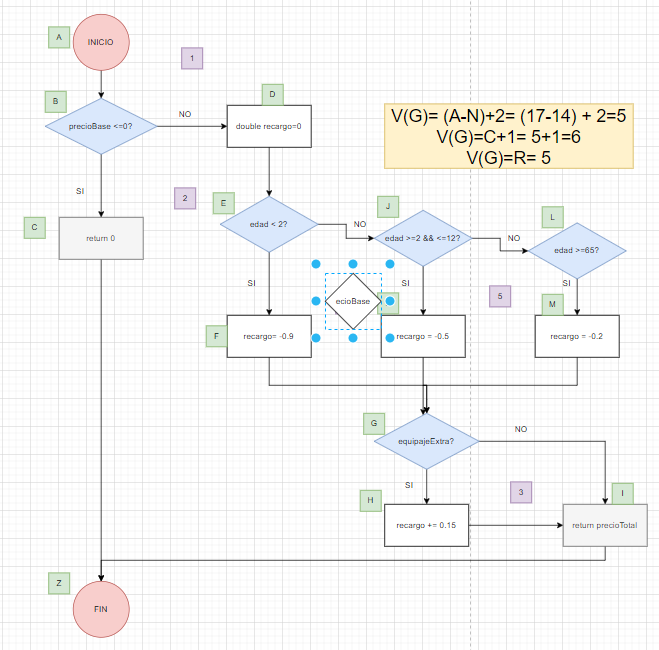

# Ejercicio: Pruebas de Caja Blanca y Caja Negra (Aeropuertos)

## 1. Descripción

En esta tarea trabajarás con una clase Java llamada `GestorVuelos`. Esta clase gestiona la lógica de tarifas de vuelos y la validación de pasajeros en un aeropuerto. Deberás aplicar técnicas de análisis de software para comprobar que el sistema funciona correctamente.

---

## 2. Código Base

Copia este código en tu entorno de desarrollo para analizarlo:

```java
/**
 * Clase que gestiona tarifas y validación de pasajeros en un aeropuerto.
 */
public class GestorVuelos {

    public GestorVuelos() {}

    /**
     * MÉTODO PARA CAJA BLANCA: Calcular precio final del billete.
     */
    public double calcularTarifa(double precioBase, int edad, boolean equipajeExtra) {
        if (precioBase <= 0) {
            return 0.0;
        }

        double recargo = 0.0;

        if (edad < 2) {
            recargo = -0.90; // bebés pagan solo el 10%
        } else if (edad <= 12) {
            recargo = -0.50; // niños 50% descuento
        } else if (edad >= 65) {
            recargo = -0.20; // mayores 20% descuento
        }

        if (equipajeExtra) {
            recargo += 0.15; // 15% extra por equipaje adicional
        }

        return precioBase + (precioBase * recargo);
    }

    /**
 * MÉTODO PARA CAJA NEGRA: Validar datos de vuelo.
 */
public boolean validarVuelo(String codigoVuelo, String puerta) {
    // Código de vuelo: 2 letras mayúsculas + 3 o 4 números (ej: IB123 o FR4567)
    if (codigoVuelo == null || !codigoVuelo.matches("[A-Z]{2}[0-9]{3,4}")) {
        return false;
    }

    // Puerta de embarque: letra + número entre 1 y 50 (ej: A12, B3)
    if (puerta == null || !puerta.matches("[A-Z][1-9]|[A-Z][1-4][0-9]|[A-Z]50")) {
        return false;
    }

    return true;
}
}
```
## 3. Tareas a realizar

### Tarea 1: Análisis de Caja Blanca (Método `calcularTarifa`)

Realiza un análisis completo del flujo del método. En tu documento debes incluir:

* **Grafo de flujo:** Dibuja el diagrama de nodos y aristas del método.  
* **Complejidad Ciclomática:** Calcúlala usando:  
  * $V(G) = Aristas - Nodos + 2$  
  * $V(G) = Regiones + 1$  
  * $V(G) = Nodos\_Predicado + 1$  
* **Caminos independientes:** Identifica todos los recorridos posibles.  
* **Casos de prueba:** Diseña una tabla con los valores de entrada (`precioBase`, `edad`, `equipajeExtra`) necesarios para cubrir cada camino.  



---

### Tarea 2: Análisis de Caja Negra (Método `validarPasajero`)

Sin mirar la implementación interna, diseña las pruebas basadas en los requisitos:

* **Particiones de Equivalencia:**
  * Edad válida e inválida  
  * Pasaporte válido e inválido  

* **Análisis de Valores Límite:**
  * Edad: -1, 0, 120, 121  
  * Longitud del pasaporte: 8, 9, 10 caracteres  

* **Conjetura de Errores:**
  * Pasaporte en minúsculas  
  * Pasaporte con caracteres especiales (#, %, etc.)  
  * Pasaporte nulo o vacío  

---

### Tarea 3: Pruebas Unitarias (JUnit)

Crea una clase de prueba `GestorVuelosTest` e implementa los casos de prueba de caja blanca diseñados en la Tarea 1.

* Usa `assertEquals(valorEsperado, valorObtenido, 0.001)` para comparar resultados de tipo `double`.  
* Asegúrate de que todos los tests pasen correctamente (barra verde).  

---

## 4. Guía de Verificación

Para asegurar que tu análisis es correcto, verifica lo siguiente:

* El `else if` cuenta como una bifurcación adicional en el grafo.  
* La complejidad ciclomática debe coincidir con el número de caminos independientes.  

* Debes cubrir todos los casos:
  * Bebés (<2 años)  
  * Niños (2–12 años)  
  * Adultos  
  * Mayores (65+)  
  * Casos con y sin equipaje extra  

* En caja negra:
  * El pasaporte debe fallar si no tiene exactamente 9 caracteres  
  * Solo se permiten letras mayúsculas y números  