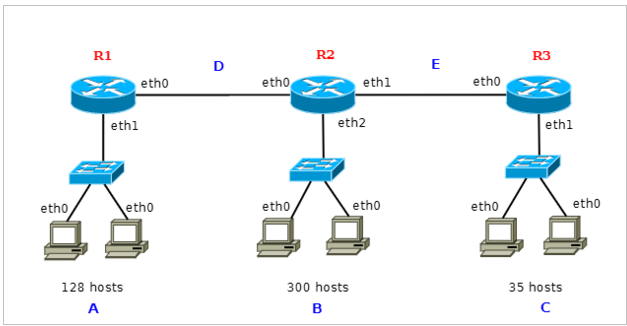

# 🌐 Cálculo de Segmentos y Direccionamiento VLSM

## 1. Identificación de Segmentos de Red

Para saber cuántos segmentos de red hay en un esquema de red, eliminamos mentalmente los routers, puesto que estos dispositivos están interconectados a las redes.

* **Regla de oro:** Todas las partes que queden aisladas, aunque solo sean un cable, son una red.
* **Resultado:** Cada segmento de red físico dará lugar a una subred.

---

## 2. Aplicación de VLSM (Máscaras de Longitud Variable)

Utilizando la dirección de red **172.16.0.0**, realiza los siguientes ejercicios:

### A. Número de Subredes

* **Pregunta:** Indica el número de subredes a direccionar según el esquema propuesto:
*(Espacio para respuesta)*

### B. Tabla de Planificación de Bloques

Completa la siguiente tabla calculando el tamaño necesario para cada subred:

| Red | Hosts | Tamaño del bloque | Máscara de subred |
|:----|:------|:------------------|:------------------|
| B   | 300+2 | 2n=302 -> n=9(512)     |                   |
| A   | 128+2 | 2n                   |                   |
| C   | 35+2  | 2n                   |                   |
| D   | 2+2   | 2n                   |                   |
| E   | 2+2   | 2n                   |                   |

### C. Registro Detallado de Subredes

Ordena las subredes de **mayor a menor** número de hosts y completa la tabla de direccionamiento:

| Red | Hosts | Dir. Red | Máscara de subred | Dir. Broadcast | Rango de direc. válidas |
|:----|:------|:---------|:------------------|:---------------|:------------------------|
|     |       |          |                   |                |                         |
|     |       |          |                   |                |                         |
|     |       |          |                   |                |                         |
|     |       |          |                   |                |                         |
|     |       |          |                   |                |                         |

---

## 3. Asignación de Direcciones a las Interfaces

Una vez que las redes están identificadas mediante su dirección de red, se procede a asignar una dirección a cada una de las interfaces de red que tiene presencia en la red.

* **Norma general:** Aunque se puede asignar cualquier dirección válida (entre la de red y broadcast), es costumbre asignar la **primera dirección útil al router (puerta de enlace)** y el resto a los hosts.
* **Configuración Estática:** Se realiza de forma manual en dispositivos que deben permanecer fijos (routers y servidores).
* **Configuración Dinámica:** Para los hosts comunes, se aplican procedimientos automáticos basados en el protocolo **DHCP**.

---

## 4. Tablas de Enrutamiento (R1 y R2)

Para que un paquete IP pueda llegar a su destino, los routers deben tener configurada su tabla de enrutamiento. Esta indica, para cada red de destino, la interfaz de salida y el siguiente salto (gateway).

**Columnas esenciales de la tabla:**

1. Dirección de red de destino.
2. Máscara de la red de destino.
3. Interfaz de salida.
4. Gateway (Siguiente salto).
